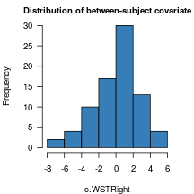

**Accompanying R code for _BLOG TITLE_.**

The settings for the simulations were derived from a model fitted to the dataset collected for an earlier 
[study](http://homeweb.unifr.ch/VanhoveJ/Pub/papers/Vanhove_CorrespondenceRules.pdf).
This dataset -- a shortened version of the original dataset -- contains a binary dependent variable (`CorrectVowel`) 
that for 21 `Item`s with Dutch _oe_ shown to 80 `Subject`s.
The participants differed in their German vocabulary scores (_Wortschatztest_ or _WST_), which was centred about the sample mean (`c.WSTRight`).
The other relevant variable is the self-explanatory `LearningCondition`, also a between-subject variable.
The distribution of the `c.WSTRight` variable is shown in the histogram below.


 

`lme4` aficionados can glean the model specification and parameter estimates from the output below,
`LearningCondition` was sum-coded (-0.5, 0.5):


```r
summary(mod)
```

```
## Generalized linear mixed model fit by maximum likelihood (Laplace
##   Approximation) [glmerMod]
##  Family: binomial  ( logit )
## Formula: CorrectVowel ~ LearningCondition + c.WSTRight + (1 | Subject) +  
##     (1 + LearningCondition | Item) + (0 + c.WSTRight | Item)
##    Data: dat_oe
## Control: glmerControl(optimizer = "bobyqa")
## 
##      AIC      BIC   logLik deviance df.resid 
##   1701.4   1744.8   -842.7   1685.4     1672 
## 
## Scaled residuals: 
##     Min      1Q  Median      3Q     Max 
## -2.9740 -0.5675 -0.2277  0.5891  5.5588 
## 
## Random effects:
##  Groups  Name              Variance Std.Dev. Corr
##  Subject (Intercept)       0.7545   0.8686       
##  Item    (Intercept)       2.9498   1.7175       
##          LearningCondition 0.0795   0.2820   0.71
##  Item.1  c.WSTRight        0.0000   0.0000       
## Number of obs: 1680, groups:  Subject, 80; Item, 21
## 
## Fixed effects:
##                   Estimate Std. Error z value Pr(>|z|)
## (Intercept)       -0.93321    0.39607  -2.356 0.018464
## LearningCondition  0.95299    0.25503   3.737 0.000186
## c.WSTRight         0.11892    0.04595   2.588 0.009656
## 
## Correlation of Fixed Effects:
##             (Intr) LrnngC
## LernngCndtn  0.169       
## c.WSTRight  -0.002  0.232
```

There wasn't any by-item variability in the covariate effect in this dataset, so I didn't include a random slope for `c.WSTRight`.
I don't know to what extent such variability would alter the results presented here.

On the basis of this model, new datasets were generated using the `simulate()` function.
The random effects for the items and participants were generated anew,
and the scores for the `c.WSTRight` variable were sampled with replacement from the original dataset.

For each simulated dataset, two model comparisons were run.
The first model comparison tested the fixed effect of learning condition without considering the between-subject covariate of `c.WSTRight` (**no covariate**).
The second comparison also tested the fixed effect of learning condition but accounted for `c.WSTRight` by means of a fixed effect (**fixed covariate**).
I didn't run model comparisons in which the covariate was modelled using a random by-item slope,
though that could be interesting when substantial by-item variability in the covariate effect is expected.
In addition to the p-values resulting from these two model comparisons,
the parameter estimates for the fixed effect of learning condition were returned.

For each combination of parameters tested,
500 simulated datasets were generated and 
the number of p-values lower than 0.05 (_power_) as well as the mean parameter estimate were calculated.
500 isn't a huge number, but fitting logistic mixed-effect models takes a _lot_ of time.
The full code for running these simulations is available from **URL**.

Incidentally, the simulations produced a lot warning messages that the `glmer` crowd will be familiar with. 
I don't know to what extent this influences the results.


