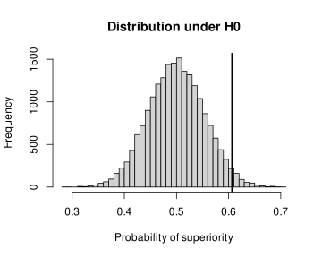

Wie schärft man eine Forschungsfrage? 
Wie plant man eine Studie, die sie beantwortet? 
Wie analysiert und präsentiert man die Daten -- 
und wie liest man andere Forschungsberichte kritisch? 
Diese Fragen begleiten meine Lehr- und Forschungstätigkeit seit über 15 Jahren.
Als Sprachwissenschaftler mit einem BSc in Informatik,
einem MSc in Statistik und Data Science
und einer Promotion in angewandter Linguistik
teile ich meine Erfahrung gerne
durch Lehrveranstaltungen und persönliche Begleitung.

Folgende Angebote richten sich insbesondere an
Studierende, Doktorierende und Forschende
in den Geistes- und Sozialwissenschaften.
Wichtig ist mir dabei stets das konzeptuelle Verständnis der Teilnehmenden
und die Frage nach der Relevanz der Verfahren --
und nicht einfach eine Datenanalyse nach Schema F.

Lehre und Beratung sind sowohl auf Englisch als auch auf Deutsch möglich.
Lernmaterialien werden auf Englisch zur Verfügung gestellt.

Bei Interesse an einem Angebot, für zusätzliche Ideen oder für weitere Auskünfte
schreiben Sie mir gerne unverbindlich unter 
[janvanhove@gmail.com](janvanhove@gmail.com).

## Kurse für Doktoratsprogramme und Winter und Summer Schools
In diesen Kursen werden allgemeine Prinzipien für die Analyse und Aufbereitung
von quantitativen Daten vermittelt,
die sowohl für neue als auch für routinierte Forschende relevant sind.
Diese Prinzipien werden anhand von Datensätzen illustriert,
die ich den Teilnehmenden zur Verfügung stelle.
Wenn Sie sich wünschen, dass die Datensätze der Kursteilnehmenden selber genauer
unter die Lupe genommen werden,
so eignen sich die Formate [Sprechstunden](#sprechstunden) und 
[Methoden- und Statistikberatung](#beratung) hierfür besser.

### Arbeiten mit Datensätzen in R {#datensätze}
::: columns
::: {.column width="55%"}
Das Aufwendigste einer Datenanalyse ist oft,
die Daten überhaupt in ein analysierbares Format zu bringen.
In diesem Kurs lernen Teilnehmende,
wie Datensätze sinnvoll organisiert werden können,
wie man sie so umgestalten kann, dass sie in einem geeigneten Format vorliegen,
wie man sie abfragt und zusammenfasst --
und wie man Fehler bei der Dateneingabe auf den Grund geht.
Hierfür arbeiten wir mit R und zwar hauptsächlich mit den Paketen 
aus dem `tidyverse`.
:::
::: {.column width="5%"}
:::
::: {.column width="40%"}

:::
:::

::: {.callout-note collapse="true"}
## Details
* Keine spezifischen Vorkenntnisse erforderlich.
* Inhalt:
  - Datensätze aufbereiten, einlesen, abfragen, verknüpfen, zusammenfassen und umgestalten.
  - Reproduzierbarkeit sicherstellen.
  - Übung im Umgang mit inkonsistenten Daten.
* Format:
  - 1 Termin à 4 Stunden mit Input, Beispielen und Denkaufgaben.
  - Auf Wunsch 1 weiterer Termin an einem anderen Tag mit Übungen in R.
:::

### Datenvisualisierung in R
::: columns
::: {.column width="55%"}
Ein Bild sagt bekanntlich mehr als 1'000 Worte,
und eine gute Grafik mehr als zig Tabellen.
In diesem Kurs lernen Teilnehmende, aussagekräftige Grafiken zu zeichnen,
sodass sie selbst und ihre Leserschaft besser verstehen,
wie nun die Daten eigentlich aussehen.
Wir arbeiten hauptsächlich mit dem R-Paket `ggplot2`.
:::
::: {.column width="5%"}
:::
::: {.column width="40%"}

:::
:::

::: {.callout-note collapse="true"}
## Details

* Keine spezifischen Vorkenntnisse erforderlich, aber wenn die Teilnehmenden
  mit dem Inhalt des Kurses [Arbeiten mit Datensätzen in R](#datensätze)
  vertraut sind, vervielfachen sich die Möglichkeiten.
* Inhalt:
  - Wieso Daten grafisch darstellen?
  - Histogramme, Kerndichteschätzer, Boxplots, Dotplots, Streudiagramme,
    Trendlinien, Facetting.
* Format:
  - 1 Termin à 4 Stunden mit Input, Beispielen und Denkaufgaben.
  - Auf Wunsch 1 weiterer Termin an einem anderen Tag mit Übungen in R.
:::

### Modelle und Unsicherheit grafisch darstellen
::: columns
::: {.column width="55%"}
Statistische Modelle sind öfters schwer durchsichtig.
Ausserdem liefern sie Schätzungen, die nie exakt sind.
Werden Modelle lediglich in Tabellen dargestellt,
so sind Missverständnisse udn Fehlinterpretationen vorprogrammiert.
Dieser Kurs zeigt daher, 
wie man Modelle und ihre Unsicherheit so visualisiert, 
dass die Ergebnisse sowohl für die Forschenden als auch für ihr Publikum
besser verständlich sind.
:::
::: {.column width="5%"}
:::
::: {.column width="40%"}

:::
:::

::: {.callout-note collapse="true"}
## Details

* Etwas Erfahrung mit Regressionsanalyse ist wünschenswert.
* Inhalt:
  - Punktschätzungen darstellen.
  - Punktweise und simultane Konfidenzintervalle und Konfidenzbänder.
  - Vorhersageintervalle und Vorhersagebänder.
  - Bootstrapping.
  - Einfache und multiple Regression.
  - Interaktionen.
  - Nichtlineare Effekte.
  - Logistische Regression.
* Format:
  - 1 Termin à 4 Stunden mit Input, Beispielen und Denkaufgaben.
  - Auf Wunsch können zusätzliche Techniken aus dem Bereich des
    _interpretable machine learning_ vorgestellt werden.
:::

### Design und Analyse von Experimenten mit intakten Gruppen
::: columns
::: {.column width="55%"}
Viele Interventionsstudien in der angewandten Linguistik und den Bildungswissenschaften
weisen statt einzelner Personen ganze Klassen oder Schulen den jeweiligen
Konditionen zu.
Wer diesen Umstand bei der Auswertung nicht berücksichtigt,
kommt leicht zu viel zu optimistischen Schlussfolgerungen.
Dieser Kurs erklärt, warum dies so ist und wie man Experimenten mit
intakten Gruppen angemessen entwirft und analysiert.
:::
::: {.column width="5%"}
:::
::: {.column width="40%"}

:::
:::

::: {.callout-note collapse="true"}
## Details

* Etwas Erfahrung mit Signifikanztests wäre nützlich, 
  ist aber nicht zwingend nötig.
* Inhalt:
  - Randomisierung als Inferenzbasis.
  - Exakte Signifikanztests und Annäherungen.
  - Einfaktorielle, zweifaktorielle und gemischte Designs für intakte Gruppen.
  - Designeffekt und Intraclass-Korrelation.
  - Einfache und komplexere Auswertungsverfahren.
  - Berücksichtigung von Kontrollvariablen.
* Format:
  - 1 Termin à 4 Stunden mit Input, Beispielen und Denkaufgaben.
:::

### Das allgemeine lineare Modell
::: columns
::: {.column width="55%"}
Das allgemeine lineare Modell ist das Arbeitspferd der quantitativen Datenanalyse.
Geläufige Verfahren wie t-Tests, ANOVA (Varianzanalyse) und lineare Regression
lassen sich alle als Erscheinungsformen dieses Modells verstehen,
während andere Verfahren wie
logistische Regression, gemischte Modelle und generalisierte additive Modelle
Verallgemeinerungen des allgemeinen linearen Modells sind.
Dieser Kurs befähigt die Teilnehmenden, zu verstehen,
wie das allgemeine lineare Modell genau funktioniert und wie man
seine Parameterschätzungen richtig interpretiert.
:::
::: {.column width="5%"}
:::
::: {.column width="40%"}

:::
:::

::: {.callout-note collapse="true"}
## Details

* Grundkenntnisse in deskriptiver Statistik (Mittel, Median, Varianz, Streudiagramm)
  werden vorausgesetzt.
* Inhalt:
  - Modellgleichung.
  - Optimierungskriterien und Parameterschätzung.
  - Schätzung von Unsicherheit unter unterschiedlichen Annahmen
    (Bootstrapping, t-Verteilungen).
  - Interpretation von Modellparametern, insbesondere bei multipler Regression.
  - Modellierung von Interaktionen.
  - Zusammenhang zwischen Regressionsanalyse, t-Tests, ANOVA und ANCOVA.
* Format:
  - 5 oder 6 Termine à 3 Stunden mit Input, Beispielen, Denkaufgaben und Übungen
    in R. Im Idealfall sind diese Termine über einige Woche verteilt.
:::

## Semesterveranstaltungen für Studiengänge und Forschungsgruppen
Auch für Veranstaltungen, die über ein oder mehrere Semester verteilt sind,
stehe ich nach Absprache gerne zur Verfügung.

### Einführung in die Statistik
::: columns
::: {.column width="55%"}
Diese Lehrveranstaltung vermittelt anhand von Beispielen aus der angewandten
Linguistik und benachbarten Disziplinen,
wie man quantitative Daten sinnvoll auswertet und interpretiert,
ohne dabei in blinder Anwendung von Rezepten stecken zu bleiben.
:::
::: {.column width="5%"}
:::
::: {.column width="40%"}

:::
:::

::: {.callout-note collapse="true"}
## Details

* Für Anfängerinnen und Anfänger.
* Inhalt:
  - Deskriptive Statistik.
  - Stichproben und Schätzungen.
  - Das allgemeine lineare Modell.
  - Logik, Sinn und Unsinn von Signifikanztests.
* Format:
  - Ein Semester lang wöchentlich.
  - Zwei Semesterwochenstunden von insgesamt 90 Minuten mit Input.
  - Ggf. eine Semesterwochenstunde (45 Minuten) Übungsbetrieb.
  - Mit wöchentlichen Hausaufgaben.
  - Veranstaltung von 3 bis 5 ECTS.
:::

### Lese- und Diskussionsgruppe
Viele statistische Konzepte werden im Studium oder im Selbststudium
nur oberflächlich verstanden:
Man weiss zwar, wie man ein Verfahren anwendet,
aber nicht wirklich, was es genau macht, wann es trügt
und ob es überhaupt etwas bringt.
Eine Lese- und Diskussionsgruppe bietet Forschenden und Doktorierenden
die Möglichkeit, solche Lücken in einem informellen, kollegialen
Rahmen zu schliessen.

::: {.callout-note collapse="true"}
## Details

* Für Teilnehmende mit statistischen Grundkenntnissen.
* Die Themen können in Rücksprache mit der Organisation und den Teilnehmenden
  gewählt werden.
  Ich stelle aber auch gerne selber ein Leseprogramm zusammen 
  ([Beispiel](posts/2020-06-12-stats-course/)).
* Es wird erwartet, dass die Teilnehmenden die Lektüre vorbereiten.
* Wöchentlich oder zweiwöchentlich.
:::

## Individuelle Hilfe

### Sprechstunden an Ihrer Institution {#sprechstunden}
Dank Sprechstunden vor Ort an Ihrer Institution
(z.B. drei Stunden alle zwei Wochen)
können Forschende, Studierende und andere Mitarbeitende
individuell oder in kleinen Gruppen unkompliziert Rat und Feedback einholen,
egal ob zum Studiendesign, zur Auswertung oder zur Darstellung der Ergebnisse.

### Methoden- und Statistikberatung {#beratung}
Wenn Sie punktuell individuelle Methoden- oder Statistikberatung suchen,
so stehe ich auch auf Stundenbasis zur Verfügung.

### Projektunterstützung
Wenn Sie die Datenanalyse Ihres Projekts einem routinierten
Sozialwissenschaftler und ausgebildetem Statistiker überlassen möchten,
können Sie mich auf Stundenbasis oder für ein bestimmtes Pensum engagieren.
