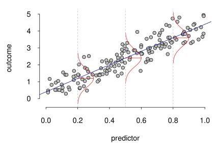
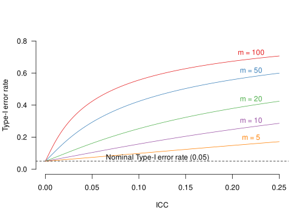
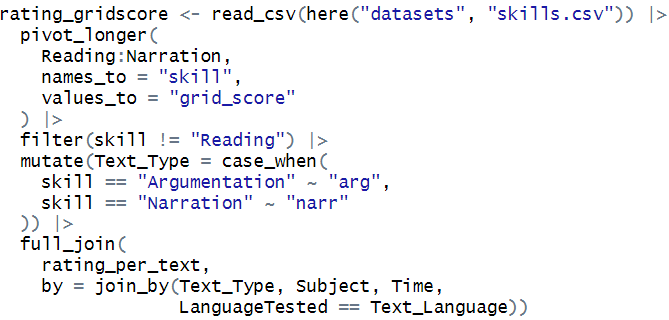
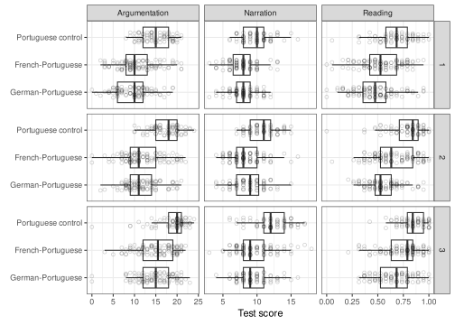
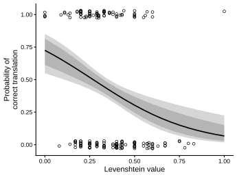

I offer one- and multi-day courses on 
quantitative methods and data analysis, 
geared principally towards Master's and PhD students, 
though they are equally suitable for postdocs or faculty. 

Below are the courses for which material is readily available
and that I can teach at fairly short notice.
I'd also gladly look into other topics for courses on request.
If any of these courses tickles your interest,
or if you have a proposal for another topic,
drop me an [e-mail](mailto:janvanhove@gmail.com) to discuss details.

Incidentally, if you're looking for individual consulting 
or standing department office hours rather than a structured course,
check out the [Methods and stats support](support.qmd) page.

::: {.callout-note collapse="true"}
## Rates
The reference rates are CHF 800 for a half-day course
and CHF 1,200 for a full-day course.
This does not include transport or, 
where applicable, lodging.
If a course needs to be tailored substantially 
to the specific participant
group or if it needs to be designed from scratch, 
this may be reflected in the quote.
But even if this doesn't quite fit your budget, **get in touch anyway**:
depending on timing and location, we may be able to work something out.
:::

## The general linear model
::: columns
::: {.column width="55%"}
The general linear model is the workhorse of quantitative data analysis.
Common procedures such as _t_-tests, ANOVA and linear regression can be 
understood as instances of this models,
and other procedures such as logistic regression, mixed-effects models
and generalised additive models are generalisations of it.
Participants will learn how the general linear models works,
how the parameter estimates it produces should be interpreted,
and how the uncertainty about these estimates can be expressed.
:::
::: {.column width="5%"}
:::
::: {.column width="40%"}

:::
:::

::: {.callout-note collapse="true"}
## Details
* This course assumes familiarity with descriptive statistics
(e.g., mean, median, variance, scatterplot).
* This is a three-day course that includes theory, worked examples,
paper-and-pencil exercises and practical exercises in R. 
Ideally, it is scheduled over the course
of a few weeks so that the participants can let the concepts sink in 
and try their hand at some exercises.
:::

## Design and analysis of experiments with intact groups
::: columns
::: {.column width="55%"}
In lots of intervention studies in education and applied linguistics,
intact classes or schools are assigned to the conditions in
their entirety. 
It is imperative that the analysis should reflect the fact that the 
participants weren't assigned to the conditions on an individual basis,
otherwise it is embarrassingly easy for the study to yield overly optimistic
findings.
This course explains why this is so and how experiments with intact groups
can be designed and analysed appropriately.
:::
::: {.column width="5%"}
:::
::: {.column width="40%"}

:::
:::

::: {.callout-note collapse="true"}
## Details
* Some experience with basic statistics (including hypothesis testing)
is helpful but not strictly required.
* The course covers the principle of randomisation as a basis for
statistical inference, exact and approximate hypothesis test,
one-factorial, two-factorial and mixed designs for intact groups,
the design effect and the intra-class correlation,
simple and more complex analytical techniques,
and the use of control variables.
* Available as a half-day course with theory, worked examples,
and paper-and-pencil exercises.
:::

## Working with data sets in R {#datasets}
::: columns
::: {.column width="55%"}
Often, the most time-consuming part of a data analysis
is getting the data into a format in which they can be analysed
in the first place.
This course covers principles for organising data sets,
techniques for transforming them so that are amenable to analysis,
as well as ways to query and summarise them.
The course relies principally on the `tidyverse` suite for R.
:::
::: {.column width="5%"}
:::
::: {.column width="40%"}

:::
:::

::: {.callout-note collapse="true"}
## Details
* No prerequisites.
* Available as a half-day course including theory, worked examples and 
pen-and-paper exercises.
* A session covering practical exercises in R can be organised at a separate
date in order to give participants some time to process the contents and
have a stab at doing some exercises at their own pace.
:::

## Visualising data in R
::: columns
::: {.column width="55%"}
Both researchers and readers can glean more understanding from a well-chosen
data visualisation than from a bunch of tables.
This course teaches techniques for drawing informative data plots
so that the participants and their readership may better understand
what their data really look like.
The main tool we'll use is the `ggplot2` package for R.
:::
::: {.column width="5%"}
:::
::: {.column width="40%"}

:::
:::

::: {.callout-note collapse="true"}
## Details
* While no prerequisites are required to appreciate the main ideas, 
participants will be better able to draw their own plots 
if they are also familiar with the contents of the course [Working with data sets in R](#datasets).
* The techniques covered include histograms, kernel density estimation,
boxplots, dotplots, scatterplots, trend lines, and facetting.
* Available as a half-day course including theory, worked examples and 
pen-and-paper exercises.
* A session covering practical exercises in R can be organised at a separate
date in order to give participants some time to process the contents and
have a stab at doing some exercises at their own pace.
:::

## Visualising models and their uncertainty
::: columns
::: {.column width="55%"}
Statistical models are often quite opaque.
Moreover, they yield estimates as opposed to exact answers.
When models are reported solely in tables,
erroneous interpretations are therefore bound to occur.
This course teaches techniques for visualising statistical models
and their uncertainty that will help make the participants' models
easier to interpret correctly.
:::
::: {.column width="5%"}
:::
::: {.column width="40%"}

:::
:::

::: {.callout-note collapse="true"}
## Details
* Participants should have some basic practical experience with regression
modelling.
* The course covers point estimates,
pointwise and simultaneous confidence intervals and confidence bands,
prediction intervals,
bootstrapping techniques,
visualising simple and multiple linear regression models,
visualising interactions and non-linearities,
visualising logistic regression.
On request, further techniques related to the kinds of model the participants
use can be discussed as can techniques from the realm of 
_interpretable machine learning_.
* Available as a half-day course with theory, worked examples, and 
pen-and-paper exercises.
:::
