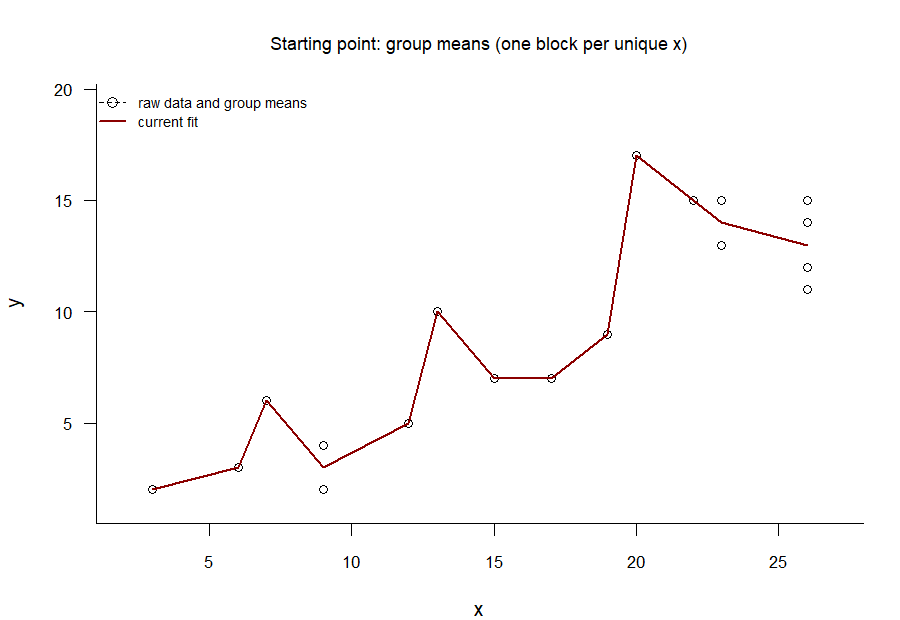

When fitting a trend line to a scatterplot,
every now and then, you just _know_ that the 

In simple ordinary-least squares linear regression, we are given pairs of observations
$(x_1, y_1), \dots, (x_N, y_N)$ and we compute an intercept $\alpha$ and a
slope $\beta$ such that the values $f(x_i) = \alpha + \beta x_i$ are maximally close
to $y_i, i = 1, \dots, N,$ in the least-squares sense.
That is, we search values for $\alpha$ and $\beta$ such that the quantity
$$\sum_{i = 1}^N (y_i - (\alpha + \beta x_i))^2$$
is minimal.

An 

## The idea

```{r}
#| label: fig-example-data
#| fig-cap: "A scatterplot to which we want to add a best-fitting non-decreasing trend line."
x <- c(3, 6, 7, 9, 9, 12, 13, 15, 17, 19, 20, 22, 23, 23, 26, 26, 26, 26)
y <- c(2, 3, 6, 2, 4,  5, 10,  7,  7,  9, 17, 15, 13, 15, 11, 12, 14, 15)
plot(x, y, cex = 1.0, xlab = "x", ylab = "y", bty = "l",
     xlim = c(2, 27), ylim = c(1, 18),
     cex.main = 0.9, font.main = 1,
     las = 1, cex.axis = 0.85)
```


{#fig-pava-steps}

## R code

```{r}
pava <- function(x, y, plot = TRUE, antitonic = FALSE) {
  if (antitonic) y <- -y

  y <- y[order(x)]
  y_all <- y
  x <- sort(x)
  y <- tapply(y, x, mean)
  w <- tapply(x, x, length)
  m <- length(y)
  k <- 0
  b <- 0
  s <- integer(m)
  g <- numeric(m)
  v <- numeric(m)
  
  while (k < m) {
    k <- k + 1
    vnew <- w[k]
    Gnew <- w[k] * y[k]
    
    while (k < m && y[k + 1] <= y[k]) {
      k <- k + 1
      vnew <- vnew + w[k]
      Gnew <- Gnew + w[k] * y[k]
    }
    
    b <- b + 1
    s[b] <- k
    g[b] <- Gnew / vnew
    v[b] <- vnew
    
    while (b > 1 && g[b] <= g[b - 1]) {
      s[b - 1] <- k
      vtemp <- v[b - 1] + v[b]
      g[b - 1] <- (v[b - 1] * g[b - 1] + v[b] * g[b]) / vtemp
      v[b - 1] <- vtemp
      b <- b - 1
    }
  }
  
  f <- numeric(m)
  start <- 1
  for (a in 1:b) {
    end <- s[a]
    f[start:end] <- g[a]
    start <- end + 1
  }
  
  if (antitonic) {
    y_all <- -y_all
    f <- -f
  }
  
  if (plot) {
    plot(x, y_all, xlab = "x", ylab = "y", las = 1)
    lines(unique(x), f, col = "blue")
  }
  
  list(
    x_vals = unique(x),
    y_fit  = f
  )
}

iso_predict <- function(pava_fit, x_new) {
  approx(pava_fit$x_vals, pava_fit$y_fit, xout = x_new, method = "linear")$y
}
```


## Further examples

### Continuous outcome
```{r}
#| label: fig-dekeyser
#| fig-cap: "The PAVA algorithm is easily adapted to non-increasing trend lines."
d <- read.csv("dekeyser2010.csv")
pava_fit <- pava(d$AOA, d$GJT, antitonic = TRUE, plot = FALSE)
plot(d$AOA, d$GJT, las = 1,
     xlab = "age of L2 acquisition", ylab = "L2 grammar test score")
lines(pava_fit$x_vals, pava_fit$y_fit, col = "darkred")
```

### Binary outcome
Levenshtein distances?

### Calibrating predictive algorithms

## Software versions
```{r, warning = FALSE}
devtools::session_info("attached")
```
