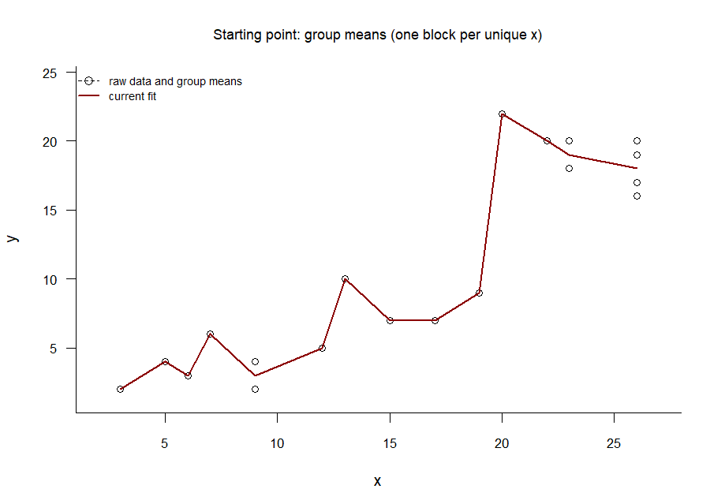

Sometimes, when fitting a trend line to a cloud of data points,
you just _know_ that the line has to go up.
It may not be a straight line, it may not be a smooth line, 
it may not even be a continuous line, but onwards and upwards it must go.
This blog post briefly introduces **isotonic regression**,
which is a technique for fitting such trend lines, and provides a few
easy-to-use R function for adding isotonic regression lines to scatterplots.

## Least-squares isotonic regression
@fig-example-data shows a scatterplot with some made-up data.
We often want to add a trend line to such scatterplots in order to better
appreciate the relationship between the $x$ and $y$ variables.
These trend lines are typically drawn so as to be optimal in some sense.
A common optimality criterion is that the trend line should show the 
graph of a function $f : \mathbb{R} \to \mathbb{R}$ that minimises
the residual sum of squares when applied to the data.
That is, given observations $(x_1, y_1), \dots, (x_N, y_N)$, 
we want our function $f$ to minimise the quantity
$$\sum_{i = 1}^N (y_i - f(x_i))^2.$$

```{r}
#| label: fig-example-data
#| fig-cap: "A scatterplot to which we want to add a trend line."
x <- c(3, 5, 6, 7, 9, 9, 12, 13, 15, 17, 19, 20, 22, 23, 23, 26, 26, 26, 26)
y <- c(2, 4, 3, 6, 2, 4,  5, 10,  7,  7,  9, 22, 20, 18, 20, 16, 17, 19, 20)
plot(x, y, cex = 1.0, xlab = "x", ylab = "y", bty = "l",
     xlim = c(min(x) - 1, max(x) + 1), ylim = c(min(y) - 0.8, max(y) + 0.8),
     cex.main = 0.9, font.main = 1,
     las = 1, cex.axis = 0.85,
     main = "Some made-up data")
```

This criterion alone doesn't usefully constrain the form of the trend line,
however.
The trend line shown in @fig-overfitting illustrates the problem.
At each observed $x$ value, the function value $f(x)$ 
is the mean of the $y$ values at this $x$ value;
between the observed $x$ values, the fitted values are linearly interpolated.
It is one of the best-fitting least-squares trend lines,
but it likely suffers from substantial overfitting.

```{r}
#| label: fig-overfitting
#| fig-cap: "This trend line minimises the residual sum of squares"
plot(x, y, cex = 1.0, xlab = "x", ylab = "y", bty = "l",
     xlim = c(min(x) - 1, max(x) + 1), ylim = c(min(y) - 0.8, max(y) + 0.8),
     cex.main = 0.9, font.main = 1,
     las = 1, cex.axis = 0.85,
     main = "A best-fitting least-squares fit")
lines(unique(x), tapply(y, x, mean), col = "darkred")
```

To obtain more useful trend lines, the form of $f$ needs to be constrained
in some way.
In simple ordinary least-squares linear regression, the constraint is that
that $f$ should be an affine function.
That is, only functions that satisfy
$$f(x) = \alpha + \beta x$$
for some numbers $\alpha$ and $\beta$ and for all $x$ are considered.
If there are at least two distinct $x$ values, the least-squares 
optimality criterion guarantees that there is a single optimal function $f$,
the graph of which is a straight line through the cloud of data;
see @fig-linreg.

```{r}
#| label: fig-linreg
#| fig-cap: "The best-fitting least-squares linear regression line"
plot(x, y, cex = 1.0, xlab = "x", ylab = "y", bty = "l",
     xlim = c(min(x) - 1, max(x) + 1), ylim = c(min(y) - 0.8, max(y) + 0.8),
     cex.main = 0.9, font.main = 1,
     las = 1, cex.axis = 0.85,
     main = "The best-fitting least-squares linear regression line")
m.lm <- lm(y ~ x)
lines(unique(x), predict(m.lm, newdata = data.frame(x = unique(x))), 
      col = "darkred")
```

While it's clear that $y$ tends to have larger values as $x$ increases,
it's not so clear that this relationship is best captured by a straight line.
Indeed, the straight line tends to underfit the $y$ values 
corresponding to the smallest $x$ values, and there seems to be a jump
in the $(x, y)$ relationship around $x = 20$ that the linear fit glosses over.

In isotonic regression, it is no longer assumed that the trend line has
to be straight. 
Instead, the constraint imposed on the form of the function $f$ is that
$f$ should be isotonic.
This is synonymous to $f$ being monotonically non-decreasing:
if $x_i \leq x_j$, then we require $f(x_i) \leq f(x_j)$.
A best-fitting function $f$ satisfying this constraint can be found
by means of the **pool adjacent violators algorithm** (**PAVA**).

The GIF in @fig-pava-steps shows the PAVA at work.^[Incidentally, I sidestep the whole [ɡɪf]--[dʒɪf]
controversy by saying [ɣɪf], as in the Dutch word for poison.]
The algorithm works as follows.

1. Start from the unconstrained best least-squares fit in @fig-overfitting.
   That is, connect the $y$ means at each value of $x$.
2. Identify the first segment where the trend line decreases.
3. Compute the mean of the $y$ values belonging to this offending segment
   (i.e., _pool_ the _adjacent violators_) and replace the trend line value
   with this pooled mean.
4. Stop if there are no further decreasing segments; otherwise go back to step 2.

{#fig-pava-steps}

Technically, the PAVA only computes the $f(x_i)$ values at the observed $x_i$
values. 
In @fig-pava-steps, I connected these $f(x_i)$ values using linear interpolation
(i.e., with straight lines), but this isn't necessary: as long as you connect
them in monotonically non-decreasing way, the function $f$ you end with
is _an_ optimal (in the least-squares sense) isotonic fit.

## R code
### PAVA
The next code snippet defines the function `pava()`
that takes `x` and `y` vectors of equal length
and outputs the least-squares isotonic fit values at the unique values of `x`.
If the parameter `plot` is set to `TRUE`, a scatterplot with the fitted
isotonic trend line is generated.
If the parameter `antitonic` is set to `TRUE`, an **antitonic** (i.e.,
monotonically non-increasing) trend line is computed instead.

```{r}
#| code-fold: show
pava <- function(x, y, plot = TRUE, antitonic = FALSE) {
  if (antitonic) y <- -y

  y <- y[order(x)]
  y_all <- y
  x <- sort(x)
  y <- tapply(y, x, mean)
  w <- tapply(x, x, length)
  m <- length(y)
  k <- 0
  b <- 0
  s <- integer(m)
  g <- numeric(m)
  v <- numeric(m)
  
  while (k < m) {
    k <- k + 1
    vnew <- w[k]
    Gnew <- w[k] * y[k]
    
    while (k < m && y[k + 1] <= y[k]) {
      k <- k + 1
      vnew <- vnew + w[k]
      Gnew <- Gnew + w[k] * y[k]
    }
    
    b <- b + 1
    s[b] <- k
    g[b] <- Gnew / vnew
    v[b] <- vnew
    
    while (b > 1 && g[b] <= g[b - 1]) {
      s[b - 1] <- k
      vtemp <- v[b - 1] + v[b]
      g[b - 1] <- (v[b - 1] * g[b - 1] + v[b] * g[b]) / vtemp
      v[b - 1] <- vtemp
      b <- b - 1
    }
  }
  
  f <- numeric(m)
  start <- 1
  for (a in 1:b) {
    end <- s[a]
    f[start:end] <- g[a]
    start <- end + 1
  }
  
  if (antitonic) {
    y_all <- -y_all
    f <- -f
  }
  
  if (plot) {
    plot(x, y_all, xlab = "x", ylab = "y", las = 1)
    lines(unique(x), f, col = "blue")
  }
  
  list(
    x_vals = unique(x),
    y_fit  = f
  )
}
```

So, for instance,
```{r}
#| code-fold: show
(pava_fit <- pava(x, y, plot = FALSE))
```


The function `iso_predict()` defined below can be used to compute
the location of the trend line at new values of $x$, as long as these
are within the range of the observed $x$ values.

```{r}
#| code-fold: show
iso_predict <- function(pava_fit, x_new) {
  approx(pava_fit$x_vals, pava_fit$y_fit, xout = x_new, method = "linear")$y
}
```

For instance,
```{r}
#| code-fold: show
iso_predict(pava_fit, x_new = c(10, 14, 19.3))
```

### A `ggplot2` geom
The next code snippet defines a ggplot geom called `geom_pava()`
with which you can add isotonic (and antitonic) trend lines to scatterplots
drawn with `ggplot2`.
You also need the `pava()` function defined above.

```{r}
library(ggplot2)

StatPava <- ggproto(
  "StatPava", Stat,
  required_aes = c("x", "y"),
  compute_group = function(data, scales, decreasing = FALSE) {
    fit <- pava(data$x, data$y, plot = FALSE, antitonic = decreasing)
    data.frame(x = fit$x_vals, y = fit$y_fit)
  }
)

geom_pava <- function(mapping     = NULL,
                      data        = NULL,
                      position    = "identity",
                      decreasing  = FALSE,
                      na.rm       = FALSE,
                      show.legend = NA,
                      inherit.aes = TRUE,
                      ...) {
  layer(
    geom        = GeomLine,
    stat        = StatPava,
    data        = data,
    mapping     = mapping,
    position    = position,
    show.legend = show.legend,
    inherit.aes = inherit.aes,
    params      = list(
      decreasing = decreasing,
      na.rm      = na.rm,
      ...
    )
  )
}
```

@fig-geompava shows the result.
```{r}
#| label: fig-geompava
#| fig-cap: "The isotonic trend line drawn with `ggplot2`."
#| code-fold: show
data.frame(x = x, y = y) |> 
  ggplot(aes(x, y)) +
  geom_point(shape = 1) +
  geom_pava(col = "darkred") +
  theme_bw()
```


## Antitonic regression
The PAVA can easily be used to draw non-increasing trend lines.
@fig-dekeyser shows some data on the relationship between
the start of L2 acquisition and the learners' performance on an L2 grammar
test culled from a study by DeKeyser et al. (2010)
with an antitonic trend line added ([download data](dekeyser2010.csv)).

```{r}
#| label: fig-dekeyser
#| fig-cap: "The PAVA is easily adapted to non-increasing trend lines. Data from DeKeyser et al. (2010)."
read.csv("dekeyser2010.csv") |> 
  ggplot(aes(x = AOA, y = GJT)) +
  geom_point(shape = 1) +
  geom_pava(decreasing = TRUE, col = "darkred") +
  xlab("age of L2 acquisition") +
  ylab("L2 grammar test score") +
  theme_bw()
```

## Generalisations and R packages
I've only given you a quick introduction to least-squares isotonic
and antitonic regression for a single predictor $x$ and a single outcome $y$
as this is the only flavour of isotonic regression that I'm reasonably familiar with.
That said, there exists a considerable literature on generalisations of this technique.
These extensions include isotonic quantile regression
and allowing for multiple predictors.
If you're interested, you may want to check out the R package `isotone`
(Mair et al. 2025) and its vignette.
Further extensions that seem useful include smoothly decreasing or increasing
trend lines, as opposed to the jagged trend lines shown in this post.
These are implemented in the `scam` package (Pya 2026).

## References
DeKeyser, Robert, Iris Alfi-Shabtay and Dorit Ravid.
2010.
[Cross-linguistic evidence for the nature of age effects in second language acquisition](https://doi.org/10.1017/S0142716410000056).
_Applied Psycholinguistics_ 31(3).
413--438.

Mair, Patrick, Jan De Leeuw and Kurt Hornik.
2025.
[`isotone`: Active set and generalized PAVA for isotone optimization](10.32614/CRAN.package.isotone).
R package, version 1.1-2.

Pya, Natalya.
2026.
[`scam`: Shape constrained additive models](https://doi.org/10.32614/CRAN.package.scam).
R package, version 1.2-22.

## Software versions
```{r, warning = FALSE}
devtools::session_info("attached")
```
