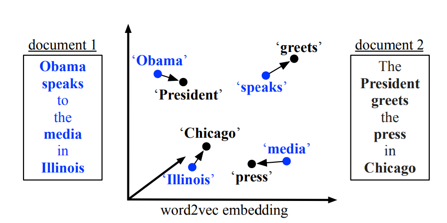
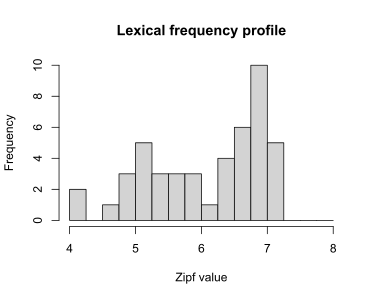
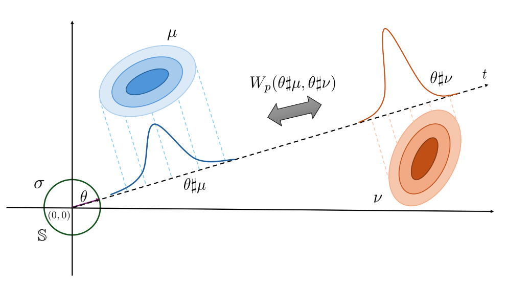
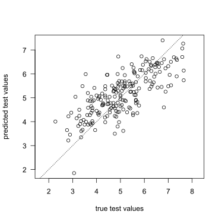

# Concept 1: Kernel methods
Certain statistical tools, 
including **Gaussian process regression** (GPR; see below)
and **support vector machines** (SVM),
don't require the predictors 
$x_1, \dots, x_n$ to be represented explicitly
(for instance, as numerical vectors).
Instead, they rely only on a notion of the pairwise **similarities** between 
the predictors.
This similarity is expressed by means of a **kernel** $k$
that takes in two predictors and outputs a number expressing the similarity
between them.
There exists a whole host of different functions that may serve as kernels.

::: {.callout-note collapse = "true"}
## Gaussian processes and kernels
The basic idea behind Gaussian process regression is that you model the 
outputs (i.e., the dependent variables) $Y_1, \dots, Y_n$
as a realisation of an $n$-variate Gaussian (= Normal) distribution.
The kernel matrix $\boldsymbol{K}$, 
which contains the pairwise kernel values $k(x_i, x_j), 1 \leq i, j \leq n$,
serves as the covariance matrix of this $n$-variate Gaussian distribution.
That is, it expresses the variance of each output $Y_i$
as well as how strongly the different outputs are correlated
with each other.

The illustrations below shows some possible (a priori) realisations of 
$\boldsymbol{Y} = (Y_1, \dots, Y_n)$ for different choices of kernel:

* The **linear kernel** essentially enables the data to be modelled 
in terms of a linear regression model.
* The **periodic kernel** is able to model sine waves and the like.
* The **Gaussian radial basis function** retrieves smoothly varying functions.
* The **Matérn(1/2) kernel** can fit jaggedly varying functions.
* The **Matérn(3/2) kernel** can fit somewhat more smoothly varying functions.

```{r}
# Random seed
set.seed(2026-07-07)

# Plotting function
plot_gpr <- function(x, K, n = 4, main = "") {
  cols <- RColorBrewer::brewer.pal(n, "Dark2")
  Y <- MASS::mvrnorm(n = n, mu = rep(0, length(x)), Sigma = K)
  plot(x = x, y = Y[1, ], ylim = range(Y), type = "n", las = 1,
     xlab = "x", ylab = "y", main = main)
  for (i in seq_len(n)) {
    points(x = x, y = Y[i, ], type = "o", col = cols[i])
  }
}

# Predictor data and distances between them
x <- seq(-5, 5, by = 0.2)
D <- outer(x, x, "-") |> abs()

# Linear kernel
K_linear <- outer(x, x, "*")
plot_gpr(x, K_linear, main = "Linear kernel")

# Periodic kernel - note that the period is the same for all curves
K_periodic <- exp(-sin(D)^2)
plot_gpr(x, K_periodic, main = "Periodic kernel")

# RBF kernel
K_rbf <- exp(-D^2)
plot_gpr(x, K_rbf, main = "Gaussian RBF kernel")

# Matérn 1/2 kernel
K_matern12 <- exp(-D)
plot_gpr(x, K_matern12, main = "Matérn(1/2) kernel")

# Matérn 3/2 kernel
K_matern32 <- (1 + sqrt(3) * D) * exp(-sqrt(3)*D)
plot_gpr(x, K_matern32, main = "Matérn(3/2) kernel")
```

Kernels can be combined with each other, for instance through 
conical combinations or pointwise multiplication.

```{r}
# Conical combinations
plot_gpr(x, 0.5*K_linear + K_periodic, main = "Linear + periodic kernel")
plot_gpr(x, 0.3*K_linear + 1.2*K_matern12, main = "Linear + Matérn kernel")

# Pointwise multiplication
plot_gpr(x, K_linear * K_periodic, main = "Linear * periodic kernel")
plot_gpr(x, K_linear * K_matern12, main = "Linear * Matérn kernel")
```
:::

There are a lot of possibilities to define a suitable kernel $k$;
see for instance 
[https://anhosu.com/post/kernels-r/](anhosu.com/post/kernels-r/).
The kernels that will be most relevant to us are those that depend
only on the pairwise **distances** $d(x_i, x_j)$
between $x_i$ and $x_j$, $1 \leq i, j \leq n$.
Such kernels are known as **stationary kernels**.^[The linear kernel used in the info box, for instance, is not a stationary kernel: The kernel value corresponding to $x_i = 4$ and $x_j = 5$ is $k(4, 5) = 20$, whereas for $x_i = 1$ and $x_j = 2$, we have $k(1, 2) = 2$. The values that this kernel produces, then, depend not only on the distance between the objects, but also on their position in the space in which they live. The reason why stationary kernels are of interest to us is that the objects we want to work with don't live in a space where the notions of both 'positions' and 'distances' makes sense. Rather, they merely live in a space in which we can say something about pairwise distances between objects.]

In the Shiny applet below, the inputs $x_1, \dots, x_n$ are real numbers.
The usual (Euclidean) pairwise distance between them is 
$$d(x_i, x_j) = |x_i - x_j|,$$
for $1 \leq i, j \leq n$.
This distance affords analysts several possibilities to build a stationary
kernel.^[You can define other kinds of distance between real numbers, 
for instance  $d(x_i, x_j) = 1$ if $x_i = x_j$ and $d(x_i, x_j) = 0$ 
if $x_i \neq x_j$.
But these wouldn't necessarily allow you to build useful kernels.]

Here are a few options:

1. The **Gaussian radial basis function** (RBF), also called the 
**squared exponential**:
$$k(x_i, x_j) = s^2\exp\left(-\frac{d^2(x_i, x_j)}{2t^2}\right)$$
with hyperparameter $s^2, t$.

2. The **power exponential**, which is a generalisation of the RBF:
$$k(x_i, x_j) = 
s^2\exp\left(-\left(\frac{d^2(x_i, x_j)}{2t^2}\right)^{\kappa}\right)$$
with an additional hyperparameter $\kappa$.

3. The Matérn kernel, here with smoothness parameter $\nu = 3/2$:
$$k(x_i, x_j) = 
s^2\left(1 + \frac{\sqrt{3}d(x_i, x_j)}{2t}\right)
\exp\left(-\frac{\sqrt{3}d(x_i, x_j)}{2t}\right).$$

Not all notions of distance $d(x_i, x_j)$ result in useful kernels,
and not all functions that depend only on $d(x_i, x_j)$
can serve as kernels.
But when working with the Euclidean distance, the functions above
satisfy all requirements, as do combinations (e.g., conical combinations and
pointwise products) of them.

Let's play around with the app a bit...
```{shinylive-r}
#| standalone: true
#| viewerHeight: 1800

library(shiny)
library(bslib)
library(corrplot)

# Stationary kernel functions --------------------------------------------------
rbf <- function(D, length_scale = 1, scaling_factor = 1) {
  scaling_factor * exp(-D^2 / (2 * length_scale^2))
}
powerexp <- function(D, length_scale = 1, scaling_factor = 1) {
  scaling_factor * exp(-(D^2 / (2 * length_scale^2))^0.5)
}
matern12 <- function(D, length_scale = 1, scaling_factor = 1) {
  scaling_factor * exp(-D / (2 * length_scale))
}
matern32 <- function(D, length_scale = 1, scaling_factor = 1) {
  r <- sqrt(3) * D / (2 * length_scale)
  scaling_factor * (1 + r) * exp(-r)
}
matern52 <- function(D, length_scale = 1, scaling_factor = 1) {
  r <- sqrt(5) * D / (2 * length_scale)
  scaling_factor * (1 + r + r^2 / 3) * exp(-r)
}

kernel_list <- list(
  "Squared exponential" = rbf,
  "Power exponential (κ = 0.5)" = powerexp,
  "Matérn 1/2"          = matern12,
  "Matérn 3/2"          = matern32,
  "Matérn 5/2"          = matern52
)

# GP conditional distribution --------------------------------------------------
cond_dist <- function(x, x0, y0, noise_var = 1e-6, kernel, ...) {
  mean_y <- mean(y0)
  y0 <- y0 - mean_y
  n  <- length(x)
  n0 <- length(x0)
  D  <- outer(c(x, x0), c(x, x0), "-") |> abs()
  K  <- kernel(D, ...)
  K11 <- K[seq_len(n), seq_len(n)]
  K12 <- K[seq_len(n), (n + 1):(n + n0)]
  K22 <- K[(n + 1):(n + n0), (n + 1):(n + n0)] + noise_var * diag(n0)
  L   <- tryCatch(chol(K22), error = function(e) NULL)
  if (is.null(L)) return(NULL)
  alpha <- backsolve(L, forwardsolve(t(L), y0))
  mu    <- as.vector(K12 %*% alpha)
  v     <- forwardsolve(t(L), t(K12))
  Sigma <- K11 - t(v) %*% v
  list(y = mu + mean_y, se = pmax(sqrt(diag(Sigma)), 0))
}

# Hyperparameter optimisation --------------------------------------------------
# Just BFGS without gradients for now.
find_gpr_hyperparameters <- function(x0, y0, kernel, runs = 10) {
  n <- length(y0)
  # Centre y at 0
  y_train <- y0 - mean(y0)
  D <- outer(x0, x0, "-") |> abs()
  # Obtain median distance between elements as useful length-scale init
  med_d <- median(D[upper.tri(D)])

  nll <- function(log_params) {
    va      <- exp(log_params[1])
    ls      <- exp(log_params[2])
    lambda2 <- exp(log_params[3])
    K <- kernel(D, length_scale = ls, scaling_factor = va) + lambda2 * diag(n)
    U <- tryCatch(chol(K), error = function(e) NULL)
    if (is.null(U)) return(Inf)
    a <- backsolve(U, backsolve(U, y_train, transpose = TRUE))
    drop(0.5 * crossprod(y_train, a) + sum(log(diag(U))) + n / 2 * log(2 * pi))
  }

  best <- NULL
  for (i in seq_len(runs)) {
    init <- c(
      scaling_factor     = runif(1, log(0.1), log(10)),
      length_scale = runif(1, log(med_d * 0.1), log(med_d * 10)),
      lambda2      = runif(1, -10, -2)
    )
    fit <- tryCatch(
      optim(init, nll, method = "BFGS"),
      error = function(e) NULL
    )
    if (!is.null(fit) && (is.null(best) || fit$value < best$value)) {
      best <- fit
    }
  }

  if (is.null(best)) return(NULL)
  list(
    scaling_factor     = exp(best$par[1]),
    length_scale = exp(best$par[2]),
    lambda2      = exp(best$par[3]),
    nll          = best$value
  )
}

# Preset functions -------------------------------------------------------------
preset_fns <- list(
  "smooth function"  = "x*sin(x)^2",
  "jagged function"  = "-0.05*x^2 + sin(x) + abs(x %% 1 - 1/2)",
  "Custom…"             = NULL
)

# UI ---------------------------------------------------------------------------
ui <- page_sidebar(
  title = "Gaussian process regression with a stationary kernel",
  theme = bs_theme(bootswatch = "yeti"),

  sidebar = sidebar(
    width = 310,

    accordion(
      open = FALSE,
      accordion_panel(
        "Data-generating mechanism",
        selectInput("preset_fn", "True function:",
                    choices = names(preset_fns), 
                    selected = names(preset_fns)[1]),
        conditionalPanel(
          "input.preset_fn === 'Custom…'",
          textInput("custom_fn", "f(x) =", value = "sin(x)",
                    placeholder = "e.g., sin(x) + 0.5*x")
        ),
        sliderInput("x_range", "x range:",
                    min = -10, max = 10, value = c(-10, 10), step = 0.5),
        numericInput("noise", "Observation noise σ²:",
                     value = 0.5, min = 0, step = 0.1)
      )
    ),

    accordion(
      open = FALSE,
      accordion_panel(
        "Observations",
        radioButtons("x0_mode", "Specify points:",
                     choices = c("Random" = "random", "Manual" = "manual"),
                     inline = TRUE,
                     selected = "manual"),
        conditionalPanel(
          "input.x0_mode === 'random'",
          sliderInput("n_pts", "Number of points:", 1, 50, 25, 
                      step = 1, ticks = FALSE),
          actionButton("resample", "Resample", class = "btn-primary w-100",
                       icon  = icon("dice"))
        ),
        conditionalPanel(
          "input.x0_mode === 'manual'",
          textInput("manual_x0", "x positions (comma-separated):", 
            value = "-9, -8, -7, -6, -5, -4, -3, -2, -1, 0, 1, 2, 3, 4, 5, 6, 7, 8, 9")
        )
      )
    ),

    accordion(
      open = FALSE,
      accordion_panel(
        "Kernel",
        selectInput("kernel", "Kernel function", choices = names(kernel_list)),
        uiOutput("hp_inputs"),
        hr(),
        tags$p("Optimise hyperparameters by maximising the 
               log marginal likelihood."),
        sliderInput("opt_runs", "Restarts:",
                    min = 5, max = 50, value = 30, step = 1, ticks = FALSE),
        actionButton("optimise", "Optimise hyperparameters",
                     class = "btn-primary w-100",
                     icon  = icon("wand-magic-sparkles")),
        uiOutput("opt_status")
      )
    )
  ),

  layout_columns(
    col_widths = 12,
    card(
      card_header("GP posterior"),
      plotOutput("gp_plot", height = "420px")
    ),
    card(
      card_header("Kernel covariance  k(x, x₀)"),
      plotOutput("kernel_plot", height = "200px")
    ),
    card(
      card_header("Correlation matrix"),
      plotOutput("corr_plot")
    )
  ),
)

# Server -----------------------------------------------------------------------
server <- function(input, output, session) {

  opt_msg     <- reactiveVal(NULL)
  opt_trigger <- reactiveVal(0)
  opt_params  <- reactiveVal(list(length_scale = 1, scaling_factor = 5, 
                                  log_noise_var = -0.3))

  # Show hyperparameter inputs
  output$hp_inputs <- renderUI({
    p <- opt_params()
    tagList(
      numericInput("length_scale", "Length scale ℓ",
                   value = round(p$length_scale, 4), min = 0.01, step = 0.1),
      numericInput("scaling_factor", "Scaling factor s²",
                   value = round(p$scaling_factor, 4), min = 0.01, step = 0.1),
      numericInput("log_noise_var", "Noise variance η² (log-10 scale)",
                   value = round(p$log_noise_var, 2), step = 0.5)
    )
  })

  # Parse target function
  f <- reactive({
    expr_str <- if (input$preset_fn == "Custom…") input$custom_fn
                else preset_fns[[input$preset_fn]]
    tryCatch(
      eval(parse(text = paste0("function(x) ", expr_str))),
      error = function(e) NULL
    )
  })

  # Observation x locations
  x0_vals <- reactive({
    input$resample
    if (input$x0_mode == "random") {
      set.seed(input$resample)
      sort(runif(input$n_pts, input$x_range[1], input$x_range[2]))
    } else {
      vals <- suppressWarnings(
        as.numeric(trimws(strsplit(input$manual_x0, ",")[[1]])))
      sort(vals[!is.na(vals)])
    }
  })

  # Observations
  obs <- reactive({
    fn <- f()
    if (is.null(fn)) return(NULL)
    x0 <- x0_vals()
    y0 <- fn(x0) + rnorm(length(x0), sd = sqrt(input$noise))
    list(x0 = x0, y0 = y0)
  })

  # Prediction grid
  x_grid <- reactive({
    seq(input$x_range[1], input$x_range[2], length.out = 201)
  })

  # Step 1: show spinner and fire trigger
  observeEvent(input$optimise, {
    xy0 <- obs()
    if (is.null(xy0) || length(xy0$x0) < 3) {
      opt_msg(tags$span("⚠ Need at least 3 observations to optimise."))
      return()
    }
    opt_trigger(isolate(opt_trigger()) + 1)
  })

  # Step 2: run optimisation in a new flush
  observeEvent(opt_trigger(), {
    req(opt_trigger() > 0)
    xy0  <- isolate(obs())
    kern <- kernel_list[[isolate(input$kernel)]]

    result <- tryCatch(
      find_gpr_hyperparameters(xy0$x0, xy0$y0, kernel = kern,
                               runs = isolate(input$opt_runs)),
      error = function(e) NULL
    )

    if (is.null(result)) {
      opt_msg(tags$span("✗ Optimisation failed. Try different settings."))
      return()
    }

    opt_params(list(
      length_scale = result$length_scale,
      scaling_factor     = result$scaling_factor,
      log_noise_var   = max(log10(result$lambda2), -30)
    ))

    opt_msg(tags$span(
      style = "color:#27ae60; font-size:0.82rem;",
      sprintf("✓ Done.  ℓ = %.2f,  s² = %.2f,  η² = 10^%.1f  (NLL = %.1f)",
              result$length_scale, result$scaling_factor,
              log10(result$lambda2), result$nll)
    ))
  }, ignoreInit = TRUE)

  output$opt_status <- renderUI({ opt_msg() })

  # Active hyperparameters: opt_params when set, else input values
  hp <- reactive({
    p  <- opt_params()
    ls <- if (!is.null(input$length_scale)) input$length_scale 
                                       else p$length_scale
    sf <- if (!is.null(input$scaling_factor)) input$scaling_factor 
                                         else p$scaling_factor
    nv <- if (!is.null(input$log_noise_var)) input$log_noise_var  
                                        else p$log_noise_var
    list(length_scale = ls, scaling_factor = sf, log_noise_var = nv)
  })

  # GP fit
  gp_fit <- reactive({
    fn  <- f()
    if (is.null(fn)) return(NULL)
    xy0  <- obs()
    kern <- kernel_list[[input$kernel]]
    p    <- hp()
    req(p$length_scale, p$scaling_factor, p$log_noise_var)
    fit  <- cond_dist(x_grid(), xy0$x0, xy0$y0,
                      noise_var = 10^p$log_noise_var,
                      kernel = kern,
                      length_scale = p$length_scale,
                      scaling_factor = p$scaling_factor)
    list(fit = fit, x0 = xy0$x0, y0 = xy0$y0)
  })

  # GP posterior plot
  output$gp_plot <- renderPlot({
    fn  <- f()
    obj <- gp_fit()
    fit <- obj$fit
    x0  <- obj$x0
    y0  <- obj$y0
    x   <- x_grid()

    par(mar = c(4, 4, 1, 1), bg = "white", family = "sans")
    y_fn <- if (!is.null(fn)) fn(x) else rep(0, length(x))

    ylim_base <- if (!is.null(fit)) {
      range(c(fit$y + 2.5 * fit$se, fit$y - 2.5 * fit$se, y_fn), na.rm = TRUE)
    } else {
      range(y_fn, na.rm = TRUE)
    }
    ylim <- ylim_base + diff(ylim_base) * c(-0.05, 0.05)

    plot(NULL, xlim = input$x_range, ylim = ylim,
         xlab = "x", ylab = "y", bty = "l", las = 1)
    grid(col = "grey90", lty = 1)

    if (!is.null(fit)) {
      ord <- order(x)
      px  <- x[ord]
      pmu <- fit$y[ord]
      pse <- fit$se[ord]
      
      valid <- is.finite(pmu) & is.finite(pse)
      px  <- px[valid]
      pmu <- pmu[valid]
      pse <- pse[valid]
      
      poly_x <- c(px, rev(px))
      poly_y <- c(pmu + 2 * pse, rev(pmu - 2 * pse))
      polygon(poly_x, poly_y, col = adjustcolor("#2c7bb6", 0.15), border = NA)
      lines(px, pmu, col = "#2c7bb6", lwd = 2.5, lty = 1)
    }
    if (!is.null(fn)) {
      lines(x, y_fn, col = "#d7191c", lwd = 1.5, lty = 2)
    }
    points(x0, y0, pch = 21, bg = "white", col = "#333", cex = 1.6, lwd = 2)
    legend("topright", bty = "n", cex = 0.85,
           legend = c("Posterior mean", "±2 SE", "True function", "Observations"),
           lty    = c(1, NA, 2, NA),
           pch    = c(NA, 15, NA, 21),
           lwd    = c(2.5, NA, 1.5, NA),
           col    = c("#2c7bb6", adjustcolor("#2c7bb6", 0.3), "darkred", "#333"),
           pt.cex = c(NA, 2, NA, 1.6))
  })

  # Kernel covariance plot -----------------------------------------------------
  output$kernel_plot <- renderPlot({
    kern  <- kernel_list[[input$kernel]]
    p     <- hp()
    req(p$length_scale, p$scaling_factor)
    d_seq <- seq(0, max(abs(input$x_range)), length.out = 300)
    k_val <- kern(d_seq,
                  length_scale = p$length_scale,
                  scaling_factor     = p$scaling_factor)

    par(mar = c(4, 4, 0.5, 1), bg = "white", family = "sans")
    plot(d_seq, k_val, type = "l", col = "#2c7bb6", lwd = 2,
         xlab = "|x - x₀|", ylab = "k(x, x₀)", bty = "l", las = 1,
         ylim = c(0, p$scaling_factor * 1.05))
    grid(col = "grey90", lty = 1)
    abline(h = p$scaling_factor, lty = 3, col = "grey60")
  })
  
  # Implied correlation matrix -------------------------------------------------
  output$corr_plot <- renderPlot({
    x0 <- obs()$x0 |> sort()
    kern <- kernel_list[[input$kernel]]
    p <- hp()
    req(p$length_scale, p$scaling_factor, p$log_noise_var)
    D <- outer(x0, x0, "-") |> abs()
    M <- kern(D, 
              length_scale = p$length_scale, scaling_factor = p$scaling_factor)
    cor_mat <- cov2cor(M)
    corrplot(cor_mat,
         method = "color",
         col = colorRampPalette(c("red", "white", "blue"))(200),
         tl.col = "black",   
         tl.cex = 0.8,       
         addCoef.col = NULL,
         cl.lim = c(-1, 1))
  }, height = 380, width = 380)
}

shinyApp(ui, server)
```

# Concept 2: Distributions as inputs
For common methods such as linear regression or random forests,
the inputs are represented as numeric vectors.
However, not all data structures naturally occur as vectors:

:::: {.columns}

::: {.column width="25%"}

:::

::: {.column width="40%"}

:::

::: {.column width="35%"}

:::
::::

In all of these cases, you can try to represent certain characteristics
of the objects (e.g., the mean Zipf value) 
in **feature vectors** which can then be 
input into linear regression, random forests, etc.
While this inevitably results in a loss of information, the hope is 
that the feature vector captures the relevant aspects.

One alternative is to either treat or encode the objects as **probability distributions**
in the hopes that this loses less relevant information than a representation
by means of a feature vector does.
For lexical frequency profiles and point clouds, this representation
as a probability distribution is immediate:
You treat the lexical frequency profile or the point cloud as an empirical
distribution.
For graphs, this takes a bit more work, but useful encodings exist.

# Concept 3: Distances between distributions
The goal is now to apply kernel methods using inputs that are represented as
distributions.
To this end, we need a suitable distance metric between probability distributions.
When dealing with **univariate distributions**, it turns out that 
the so-called **Wasserstein distance of order $p = 2$** is useful
in the sense that it can be slotted into the Gaussian RBF, the power
exponential, and the Matérn functions to give suitable kernels.^[The more
specific reason is that it can be shown that the Wasserstein distance of order
2 between univariate distribution is a so-called Hilbertian distance,
and Hilbertian distances can be slotted into these functions to obtain
suitable kernels.]

Informally, the Wasserstein distance between probability distributions $P$ and $Q$
expresses what the least amount of effort is that you need to expend 
in order to shift about the probability mass of distribution $P$
so that it corresponds to that of distribution $Q$.
For the Wasserstein distance of order $p = 2$, 'effort' is defined
in terms of squared distances.

Computing the Wasserstein distances between univariate empirical distributions 
can be done pretty cheaply and essentially boils down to running two sorting operations.

When working with **multivariate distributions**, however,
Wasserstein distances are no longer attractive:

1. They are much more difficult to compute.
2. They can't be slotted into the Gaussian RBF, the power
exponential, and the Matérn functions to give suitable kernels.^[In contrast to 
Wasserstein distance of order 2 between univariate distributions, Wasserstein distances 
between multivariate distributions aren't Hilbertian.]

One option is to work with Wasserstein distances between 
**marginal distributions**.
For instance, if the distributions you're working with live in three dimensions,
you compute Wasserstein distances between the three corresponding dimensions.
You can construct kernels using the resulting three distances
and combine these into a single kernel.

One drawback of relying on marginal distributions only is 
that two distributions may look completely different from one another 
yet have the same marginal distributions:

```{r, echo = FALSE}
#| fig-cap: "These two bivariate distributions have the same marginals."
#| fig-height: 3.5
#| fig-width: 6.8
par(mfrow = c(1, 2))
n <- 200
x <- rnorm(n)
y <- rnorm(n)
plot(x, y, asp = 1)
plot(sort(x), sort(y), asp = 1, xlab = "x", ylab = "y")
par(mfrow = c(1, 1))
```

A kernel based on marginal distributions only couldn't tell distributions
with the same marginals but different joint distributions apart -- and it's 
possible that the relevant signal isn't contained in the marginals but
rather in how the different components are related to each other.

An alternative is to use the so-called **sliced Wasserstein distance** 
(of order $p = 2$):

{width=80%}

To compute the sliced Wasserstein distance, you project the multivariate
distributions onto a randomly chosen line that runs through the origin.
The resulting distributions are univariate, so we may cheaply compute
the 2-Wasserstein distance between them.
The sliced Wasserstein distance is then defined in terms of the 
expected value of the resulting 2-Wasserstein distance,
with the random bit being the choice of the line through the origin.

In practical terms, you pick a bunch of lines randomly, project
the distributions on them, compute the Wasserstein distances between
the projections, and average them.

**Advantages of the sliced Wasserstein distance:**

1. It is fairly cheap to estimate.
2. It is a valid distance between probability distributions with finite second moment. 
(This includes all empirical distributions.)
3. This distance can be slotted into the Gaussian RBF, power exponential and 
Matérn functions to give a valid kernel.
4. It takes into account the entire distributions, not just their marginals.

**Disadvantages:**

1. It takes into account the _entire_ distributions... including aspects that 
aren't relevant for the regression (or classification) task, degrading performance of the downstream model.
This isn't much of a problem when using kernels based on marginal distributions only:
when fitting the model, the irrelevant margins will get downweighted, minimising their impact on the prediction.
2. It is **scale-sensitive**: if you express one component of a distribution 
on a different scale (e.g., cm instead of inches), the downstream model will perform differently.
3. You can't really draw input-output plots like in the applet above...^[In principle, it should be possible to apply multidimensional scaling in order to draw _some_ kind of plot. But it's a far cry from a nice scatterplot.]

_Note:_ Chapter 5 of my [Master's thesis](https://github.com/janhove/mscthesis/) 
is essentially on the second problem.

I wrote the [`slicer`](https://janhove.github.io/slicer) package to carry out
sliced Wasserstein computations. 

# Now what?
It could be fun and useful to use Wasserstein distances and sliced Wasserstein 
distances to revisit problems in AL (and in the social sciences more broadly) 
that naturally call out for a distributional approach but that so far have been
tackled using feature vectors and summaries.

## Lexical frequency profiles for quality predictions
Data from [Vanhove et al. (2019)](https://doi.org/10.17239/jowr-2019.10.03.04):

* 1,020 short German texts: 816 in training set, 204 in test set.
* About 16 raters per text, 1-9 scale. 
$\leadsto$ mean rating per text as outcome.
* Lots of lexical and other properties per text.
* Generalised additive model with 6 predictors resulted in RMSE of 0.793
on the test data 
(compared to a baseline of 1.18; test set $R^2 \approx 0.55$).

Quickish attempt:

* For each of these six predictors, build an RBF kernel.
* Additionally, compute the Wasserstein distances between the lexical profiles 
(Zipf) of the distributions and build another RBF kernel.

Results:

* 6 kernels: test set RMSE 0.820 ($R^2 \approx 0.52$).
* Adding Wasserstein kernel for lexical profiles: RMSE 0.794 
($R^2 \approx 0.55$).

{width=80%}

More generally, it may be interesting to take a closer look at the literature
on representing lexical frequency profiles (Nation and Laufer, etc.)
and see if working with the distributions directly (instead of using summaries
and frequency bands) buys us something.
It may even be possible to use Wasserstein distances between lexical profiles
to carry out something akin to a _t_-test (i.e., using the distributions as
outcomes in a group comparison rather than as predictors).

That said, I don't expect these different approaches to result in huge differences.
The main advantage of the distributional approach is that it would sidestep
some arbitrary decisions (e.g., cut-offs for lexical frequency bands)
and that it could distinguish between lexical frequency profiles with different
shapes yet with the same summary statistics.

Two considerable disadvantages would be a loss of interpretability
and the need to retain the training data when making predictions for new inputs.

## Comparisons of vowel distributions

* E.g., for each speaker, measure the degree of overlap between the F1/F2/F3/duration clouds 
of /e/ and /ɛ/ realisations using Wasserstein/sliced Wasserstein.
Then compare these degrees of overlap between groups.
* Compare the clouds of /u/ realisations between speakers?
* L2 and L1 speakers produce /ɛ/ sounds. Compute the **barycentre** of the L1 vowel clouds
(roughly, the average L1 vowel cloud)? Compute distances between 
L2 vowel clouds and this barycentre.
* Compute distances between L1 and L2 vowel clouds within a speaker?
